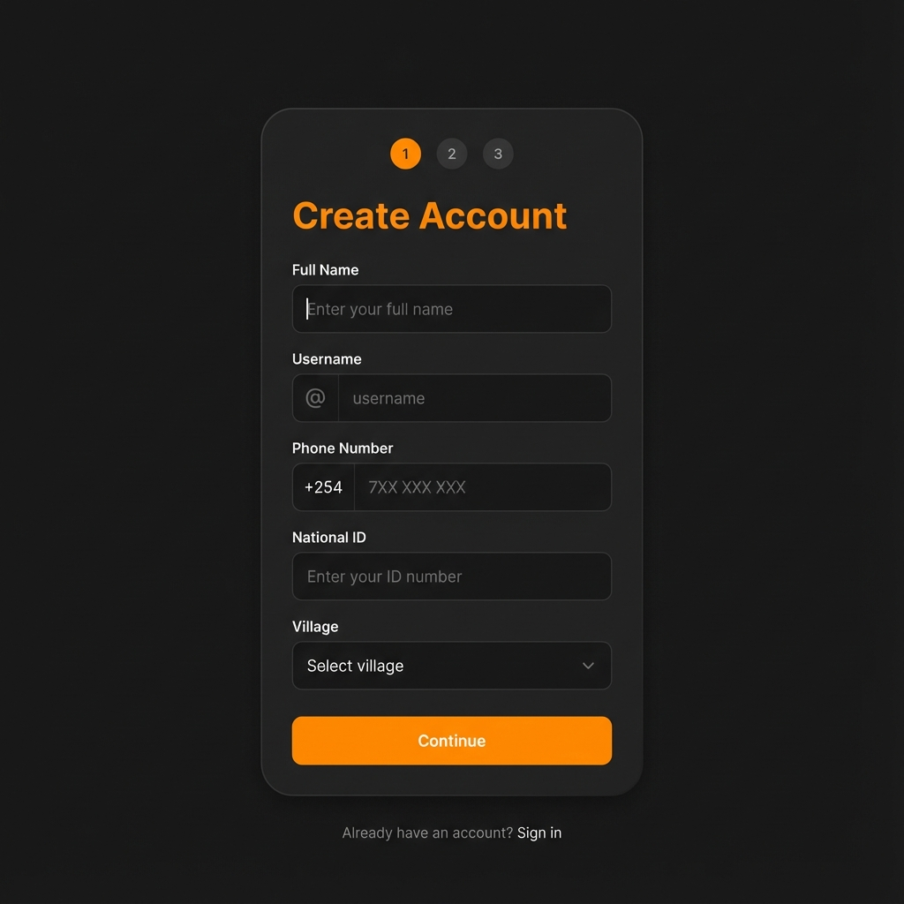
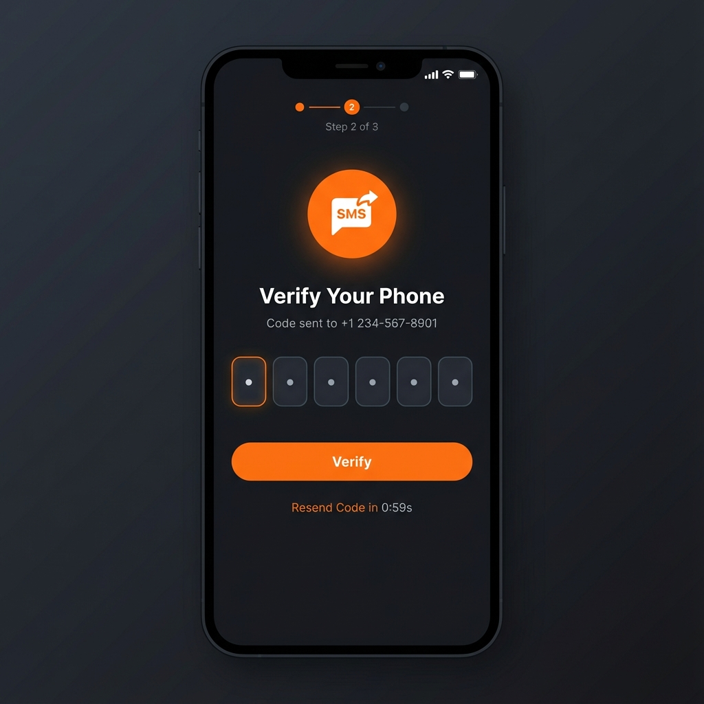
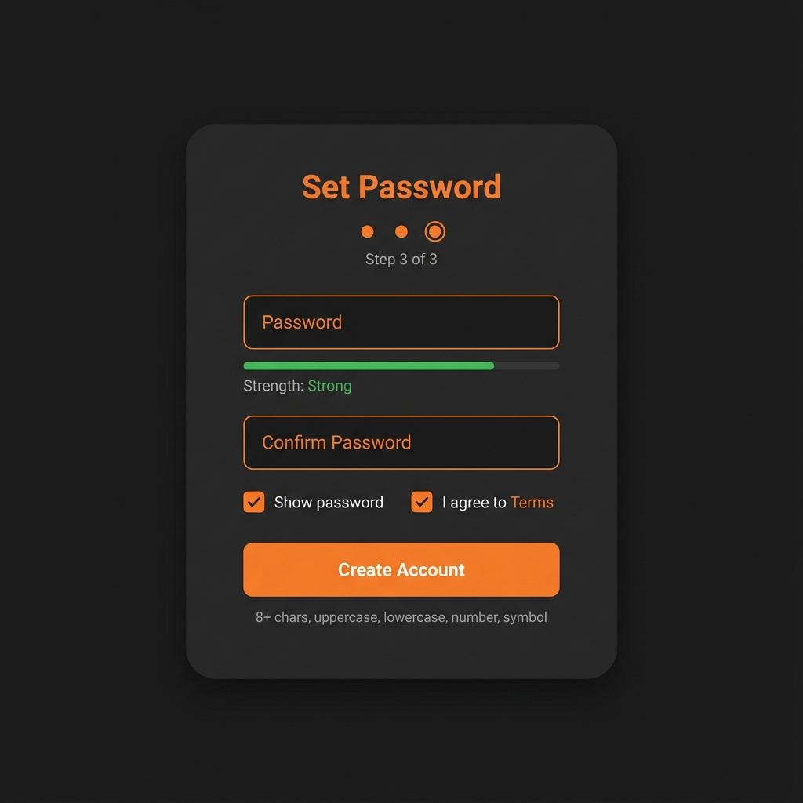
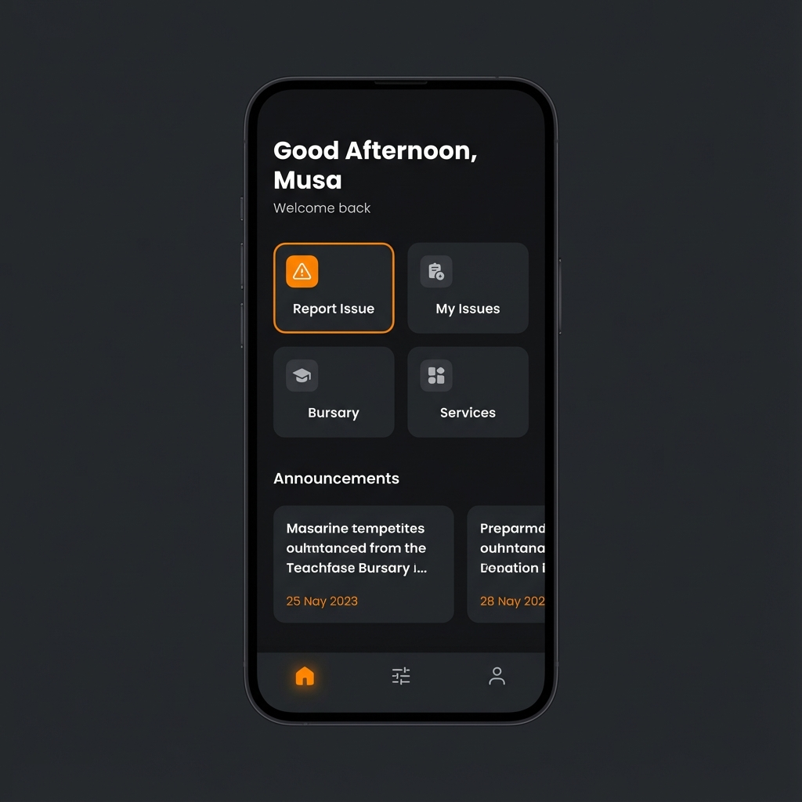
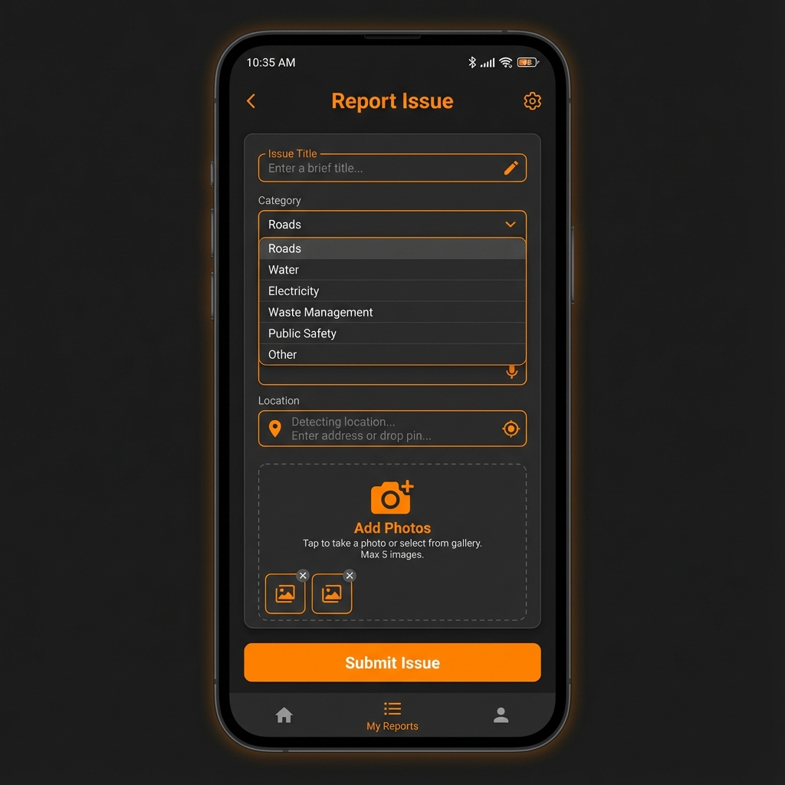
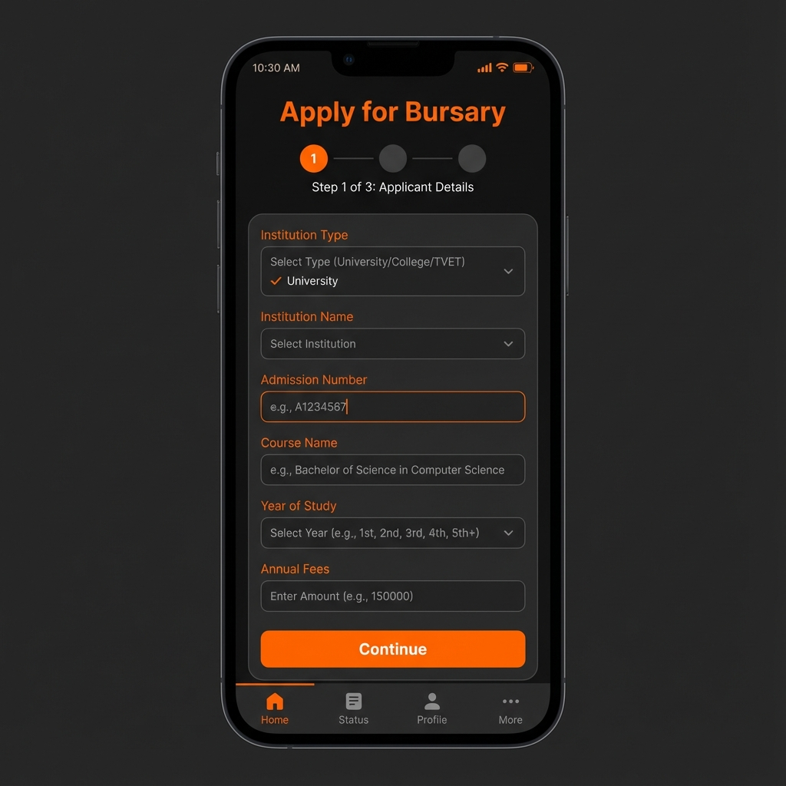
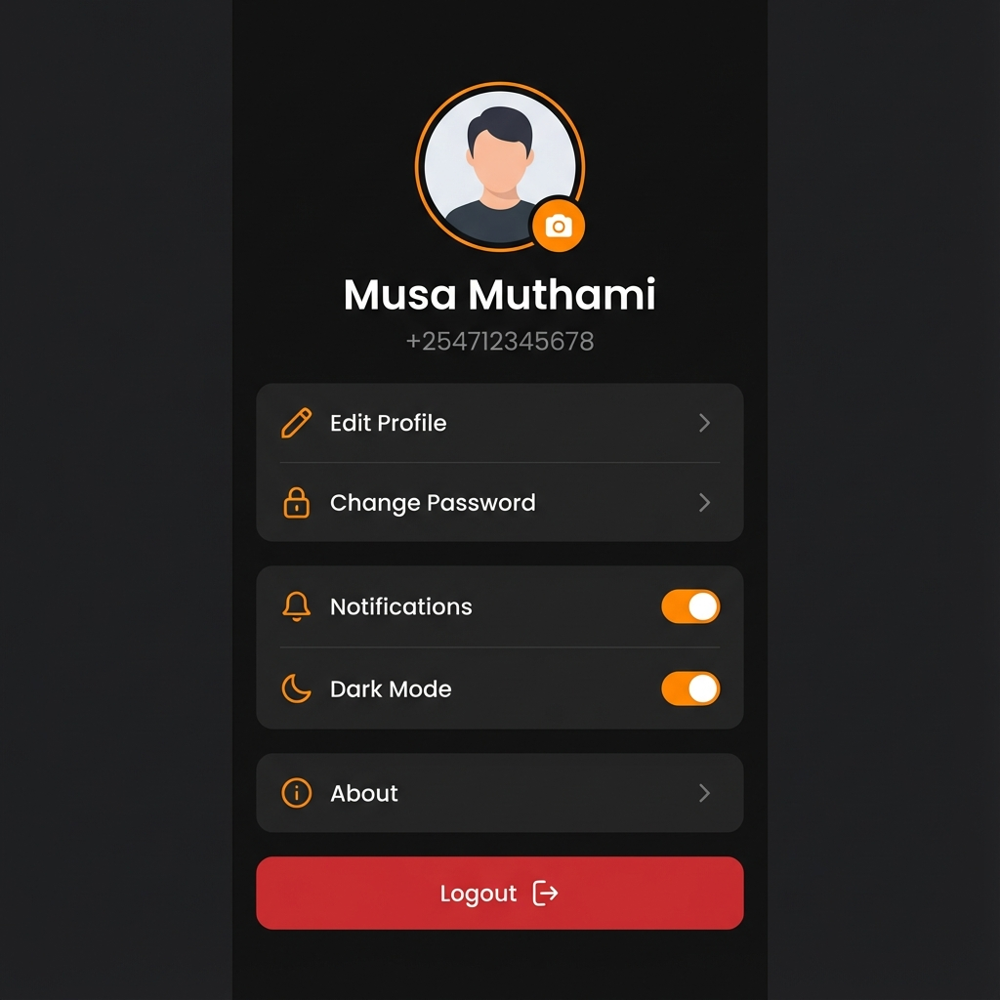

# VOO App - Dark Orange Theme Mockups

## Authentication Screens

````carousel

<!-- slide -->

<!-- slide -->

<!-- slide -->

````

## Main Screens

````carousel

<!-- slide -->

<!-- slide -->

<!-- slide -->

<!-- slide -->

````

## Theme Colors
| Element | Color |
|---------|-------|
| Background | `#1A1A1A` |
| Card | `#2A2A2A` |
| Primary (Orange) | `#FF8C00` |
| Input Fields | `#333333` |
| Text Light | `#FFFFFF` |
| Text Muted | `#888888` |

## Key Features
- ✅ Username creation during registration
- ✅ Strong password validation  
- ✅ OTP phone verification
- ✅ Time-based greeting (Morning/Afternoon/Evening)
- ✅ Profile shows name & phone from DB
- ✅ Images upload to Cloudinary

**Please review and let me know if you want any changes!**
